# FlightSurety
FlightSurety is an Ethereum DApp to manage flight insurances.

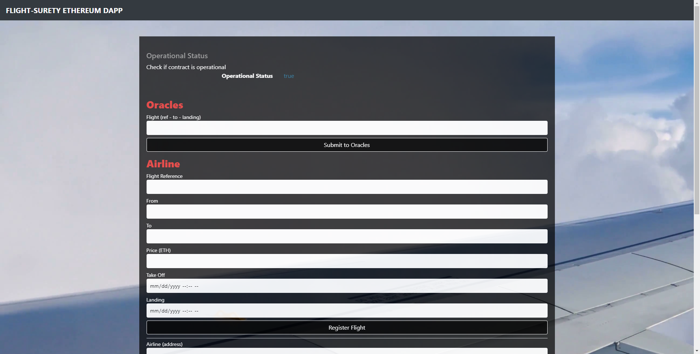

Sepid M.

## Getting Started
1.  Clone/download this repository

2.  Install dependencies
```
$ npm install
```
3.  Run tests
```
$ truffle develop
truffle(develop)> test
```
Your terminal should look something like this:

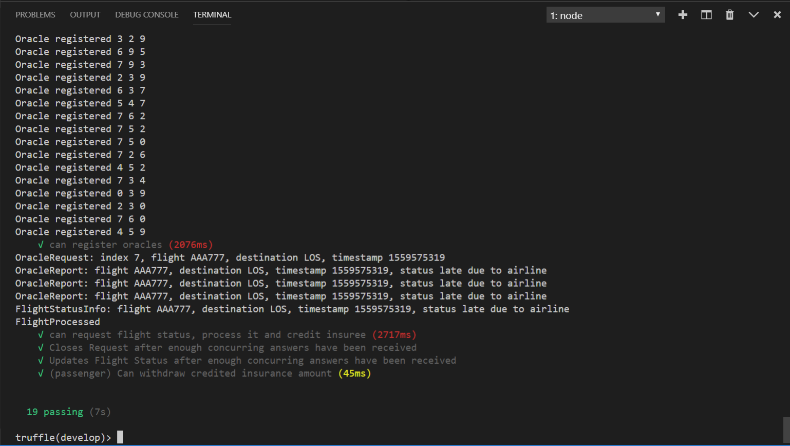

4.  Deploy locally  
Update the account argument depending on the number of addresses to load at start.
```
$ ganache-cli -m "strategy fan arch middle glass stove mask gym between beach letter fever" -a 50
```
Your terminal should look something like this:

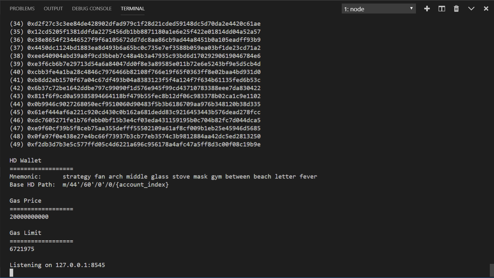

5. In a new terminal:
```
$ truffle migrate
```
Your terminal should look something like this:

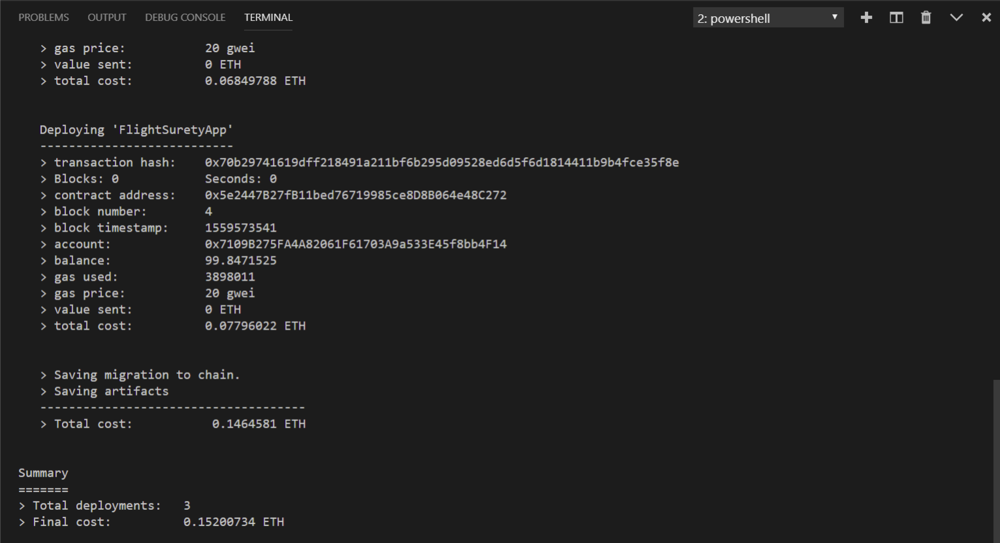

6.  Start front-end.  
In a new terminal:
```
$ npm run dapp
```
Your terminal should look something like this:

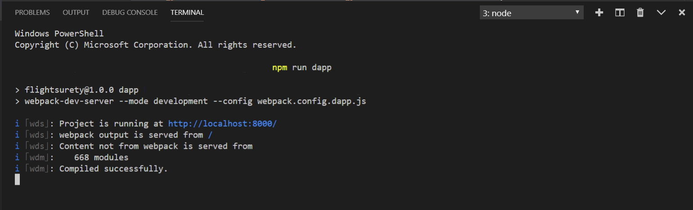

7.  Start server (for oracles and API).  
In a last terminal:
```
$ npm run server
```
Your terminal should look something like this:

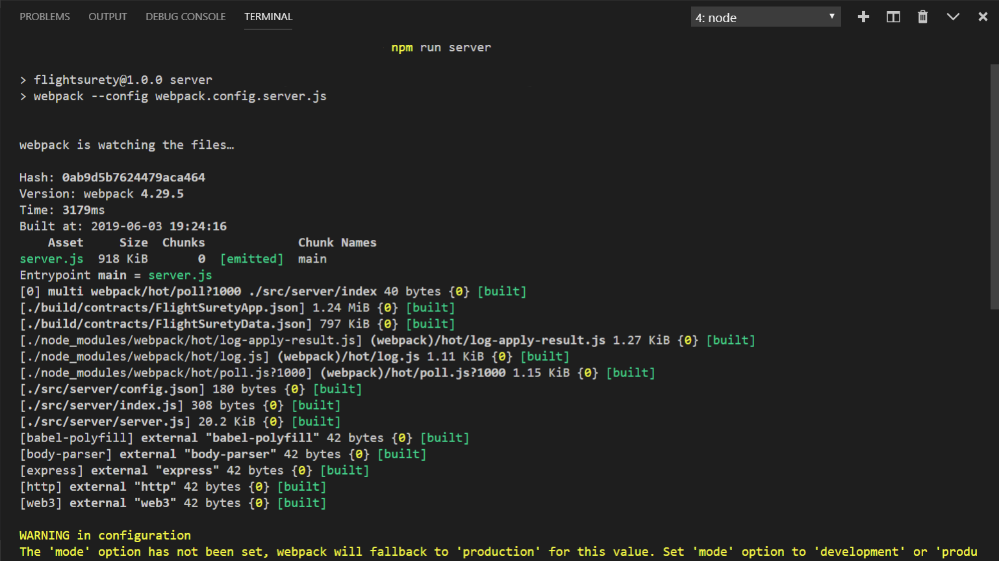

8.  Use the app:
  - Import accounts to MetaMask
  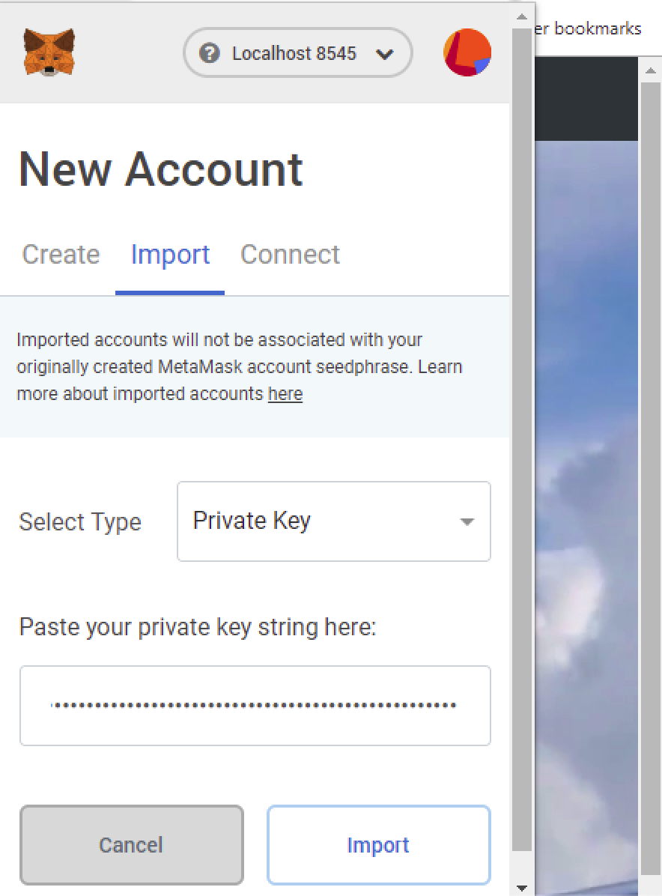

  - Go to http://localhost:8000/
  - First airline registered is the account 2 of your metamask accounts.
  - Provide funding of min 10 ETH from this address.
  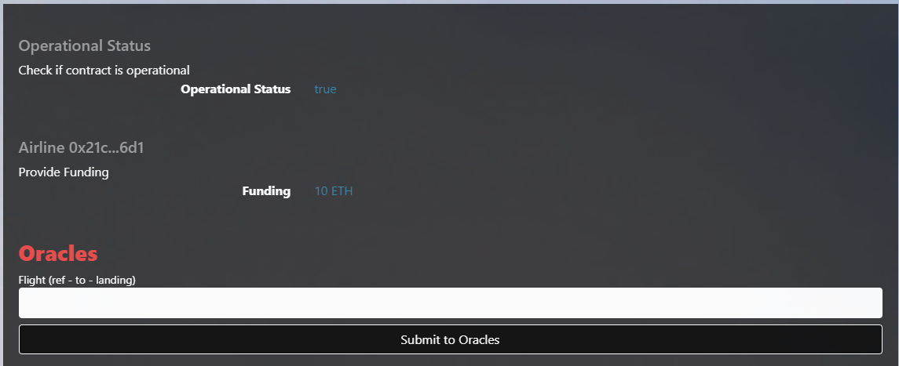

  - Register flights or (up to 3) new airlines from this address.
  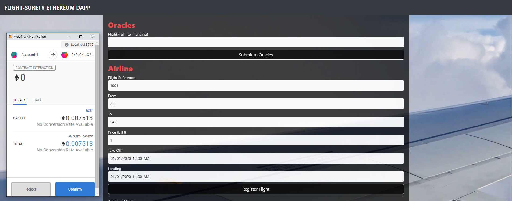

  - Switch to a 'passenger' address (e.g account 3) and book a flight.
  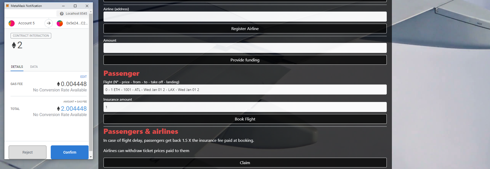

  - 1st Airline/account 2 is now able to withdraw its credited ticket price.
  - Submit request to oracles (from which account doesn't matter)
  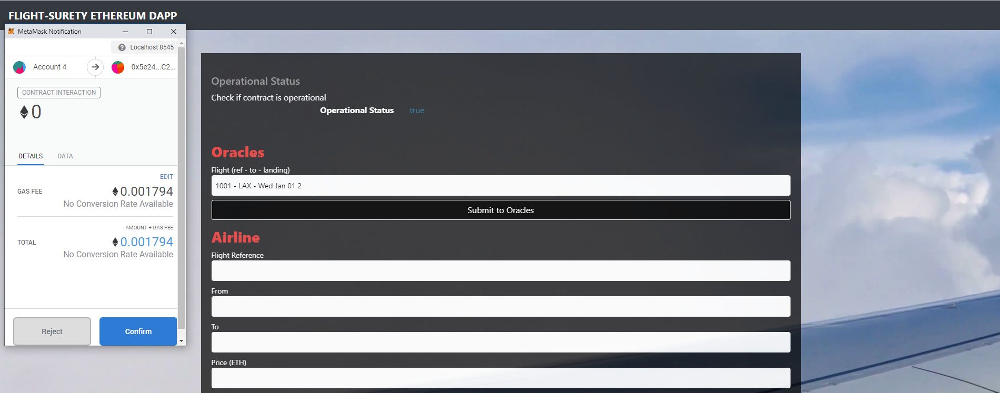
  
  - If flight is delayed, passenger/account 3 can now withdraw his credited insurance amount.
  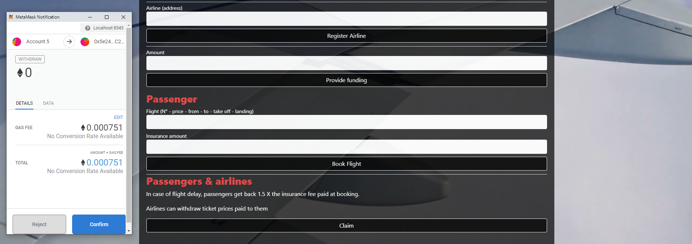  

**NOTES:  
The browser needs to be refreshed in order for the drop-down selection lists (flight booking and oracle requests) to be updated.  
Refresh is also needed after switching accounts in Metamask.**

## API
The server runs by default on port 3000.  

- **/flights**  
Get all registered flights.
Note: the front-end client get the registered flights from this end point.
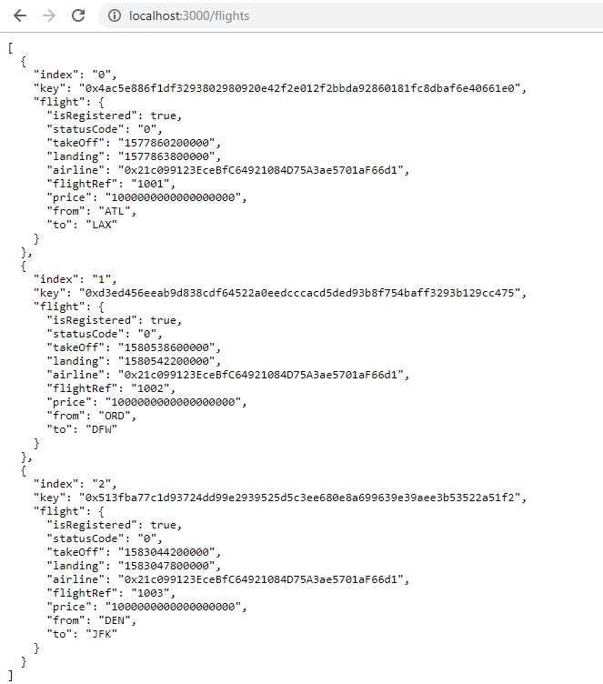

- **/flight/ref.destination.landing_timestamp**  
Get one flight
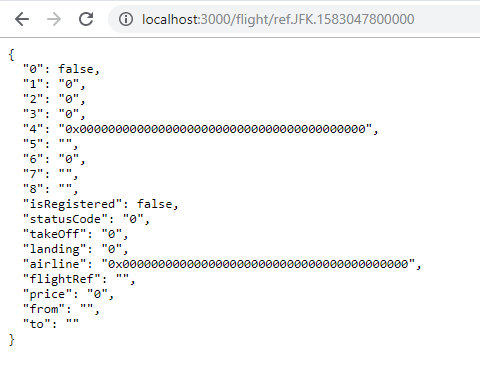

- **/response/ref.destination.landing_timestamp**  
Get a response object (isOpen and requester attributes)
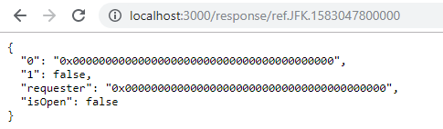

## Resources

- [Truffle](https://www.truffleframework.com/): smart contracts and DAPP development framework.
- [npm](https://www.npmjs.com/get-npm)
- [Metamask](https://metamask.io/): browser add-in to interact with the JavaScript Ethereum API [Web3](https://github.com/ethereum/web3.js/).
- [VanillaJS DOM class](https://hackernoon.com/how-i-converted-my-react-app-to-vanillajs-and-whether-or-not-it-was-a-terrible-idea-4b14b1b2faff)
- [CRUD pattern in solidity](https://medium.com/@robhitchens/solidity-crud-part-1-824ffa69509a)
